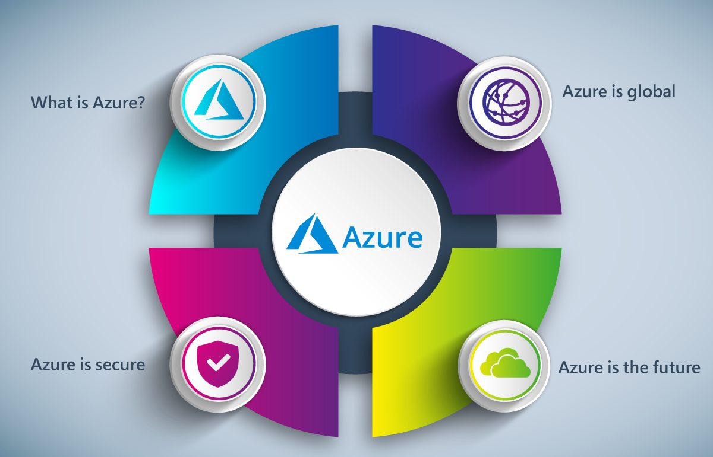

# Azure

  

Microsoft Azure es una plataforma en la nube integral proporcionada por Microsoft. Ofrece una gran variedad de servicios de computación en la nube, almacenamiento, bases de datos, inteligencia artificial, Internet de las cosas(IoT). Azure permite a las organizaciones construir, implementar y administrar aplicaciones y servicios de manera eficiente, escalable y segura.

## Importancia Actual

- **Transformación Digital**
- **Trabajo Remoto**
- **Escalabilidad y Flexibilidad**

## Impacto futuro en las salidas laborales
- **Alta Demanda de Profesionales Certificados**: Con la creciente adopción de Azure, existe una demanda significativa de profesionales certificados en tecnologías de Azure, como el rol de "Microsoft Certified: Azure Solutions Architect Expert".
- **Roles Especializados**: La certificación en Azure Solutions Architect Expert indica un nivel avanzado de experiencia en diseño e implementación de soluciones en la nube. Los profesionales con esta certificación son valiosos para diseñar arquitecturas escalables y seguras en Azure.
- **Ecosistema en crecimiento**: A medida que más empresas adoptan Azure, el ecosistema de servicios y soluciones en la nube sigue expandiéndose. Esto crea oportunidades para especializarse en áreas específicas, como seguridad en la nube, análisis de datos en la nube, inteligencia artificial, etc.
- **Innovación Continua**: Azure está en constante evolución con nuevas características y servicios. Los profesionales certificados están preparados para liderar la adopción de las últimas tecnologías y practicar la innovación continua en sus organizaciones.

## About me
- [@jonko-u](https://github.com/jonko-u)
- [Tendencias en innovacion cloud](https://www.revistacloudcomputing.com/2022/02/5-tendencias-en-innovacion-cloud-para-2022/)
